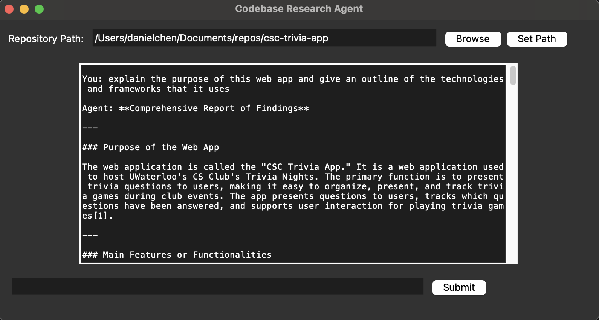
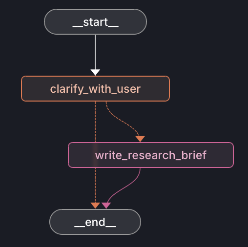
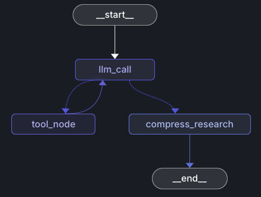

# Codebase Research Agent

Codebase Research Agent is an interactive tool that helps you explore and understand large repositories by asking natural language questions. Instead of digging through files manually, you can ask the agent about functions, structures, or design choices in your codebase, and it will provide targeted answers. The agent can also request clarifications if needed, making the interaction feel more conversational and precise.

---

## Getting Started

### Install Dependencies

This project uses [`uv`](https://github.com/astral-sh/uv) for dependency management. To install everything you need, run:

```bash
uv sync
```

## Environment Variables

API keys are required to connect to external services. Create a `.env` file in the root of the repository with the following entries:

```bash
OPENAI_API_KEY=your-openai-api-key
LANGSMITH_API_KEY=your-langsmith-api-key
```

* **`OPENAI_API_KEY`** – provides access to OpenAI models for natural language understanding and reasoning.
* **`LANGSMITH_API_KEY`** – enables LangSmith features for debugging, tracing, and monitoring the agent’s behavior.

The agent can be modified to use other AI Models, but this is currently not a feature.


### Start the Interface

Launch the application by running:

```bash
python3 interface.py
```

---

## Using the Interface

1. At the top of the interface, enter the path to the repository you want to explore.
2. Below that, type a question you have about the code.
3. The agent will respond with an answer. If the question is ambiguous, the agent may ask a follow-up clarification question, which you can answer directly in the same input field.

Here’s what the interface looks like:



---

## How It Works

This project combines several tools and frameworks to create the Agent:

* **Tkinter**: Provides the graphical user interface for input and display.
* **LangChain**: Manages the agent’s reasoning, memory, and interaction flow.
* **LLM Backends**: Power the natural language understanding and code analysis.

The design of the agent is inspired by [LangChain’s tutorial on AI agents](https://python.langchain.com/docs/tutorials/agents/), adapted to support repository-specific exploration.

---

## Architecture and Flow

The system follows a clear flow to process user queries:

* **Scope Flow** – how the repository scope is defined and passed into the agent:
  

* **Agent Flow** – how the agent interprets input, asks clarifying questions, and delivers answers:
  
